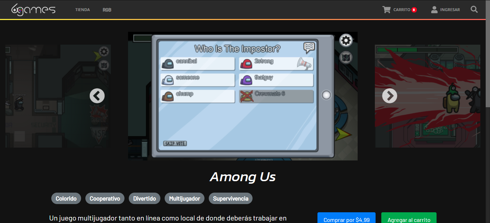

# Henry E-Commerce

## Objetivos del Proyecto

- Construir una App JavaScript desde cero.
- Afirmar y conectar los conceptos aprendidos en la carrera.
- Aprender mejores prácticas.
- Aprender y practicar el workflow de GIT.
- Utilizar Metodologías Ágiles.
- Trabajar en equipo.
- Usar y practicar testing.

## Imágenes

### Catálogo

### Filtros

### Producto

### Carrito
